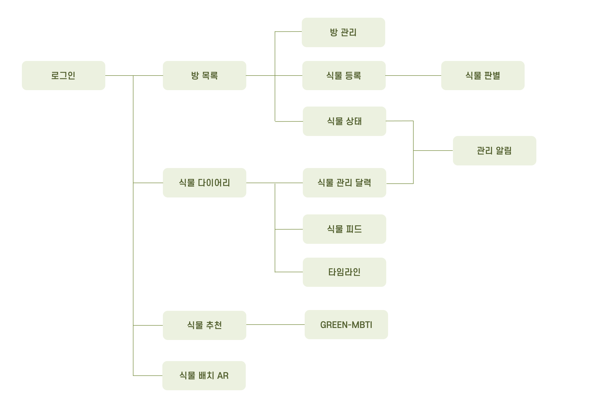
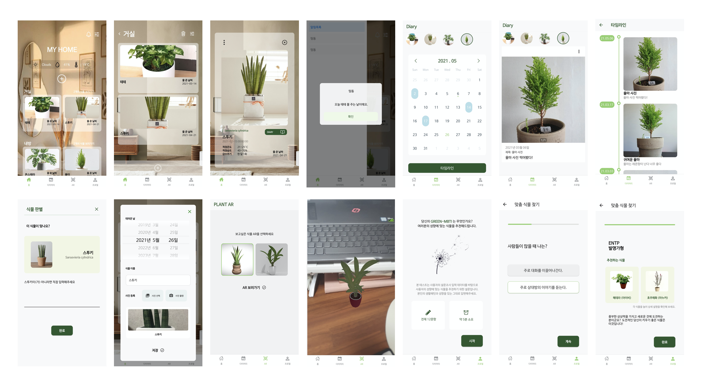

# Green Fingers
> _🌿 반려식물 종합 관리 서비스_ :  _식물 분류 AI로 식물의 정보를 간편하게 등록, 방 별로 식물 관리, 식물마다 다이어리 작성, 물주기 알림, AR을 이용한 식물 배치와 같은 다양한 기능으로 식물을 체계적으로 관리할 수 있는 어플_

<br/>

---
---

<br/>

## ✔️ Feat : 한눈에 보기 

<br/>



<br/>

## ✔️ Architecture

<br/>

## ✔️ UI : 어플 디자인



<br/>

## ✔️ Tech : 사용된 기술 

          

<br/>

## ✔️ AI : 식물 이미지 분류


```
    1. 학습에 필요한 90가지 식물마다 500개 이미지 데이터 수집/전처리(구글, 네이버 크롤링)
    2. 가공된 학습 데이터를 사전 학습된 VGG16모델을 이용하여 학습
    3. 학습된 모델(정확도 76%) API 배포
```

<br/>
<br/>

### 관련 자료 
> [관련자료 모음](https://drive.google.com/drive/folders/1oSPdB86Ki36VeyvYinZbKKB79VD2rY5n?usp=sharing)
